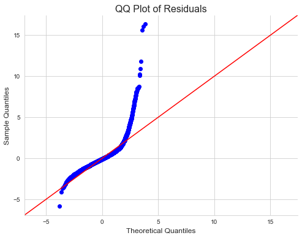
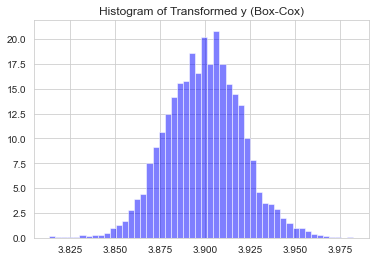
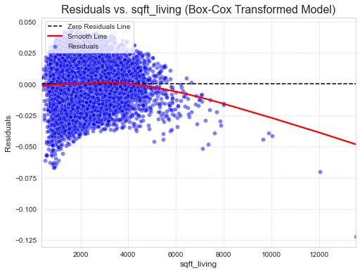
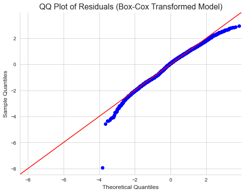
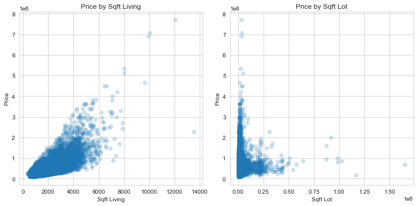
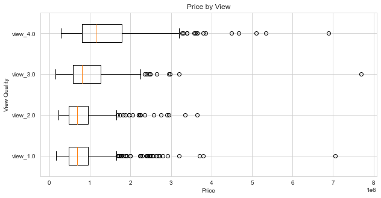

**Project Title:**  

*Optimizing Real Estate Strategies in King County: A Data-Driven Approach for Haven-Kings Property Management*

**By:**  
                - [Julliet Iswana](https://github.com/Iswana-O)
                - [Wayne Kipngeno Korir](https://github.com/waynekipngeno)
                - [Eva Kiio](https://github.com/evamwende)
                - [Oscar Mulei](https://github.com/omulei)
                
---------------------
   **Supervisor:** 
   [Asha Deen](https://moringaschool.com/courses/data-science-course-part-time/)
   
---------------------
                


#### **Business Case:**
In the thriving real estate market of King County, the capacity to make strategic pricing decisions can either enhance profits or turn assets into liabilities. Haven-Kings Property Management, with its vast portfolio, stands at a pivotal juncture where conventional pricing methods no longer suffice. The digital age demands a shift from age-old practices like the Comparative Market Analysis (CMA) and the "1% Rule" to a more agile, data-driven approach. By leveraging advanced analytical methods, such as multiple regression analysis, property management firms can tap into precise pricing strategies, enhancing revenue streams and ensuring sustainable growth.

#### **Overview:**
This project aims to harness the power of data analytics to revolutionize Haven-Kings Property Management's pricing strategies in King County's competitive real estate landscape.

#### **Objective:**

Guided by data insights and multiple regression analysis, the team sets out to:
1. **Optimize House Pricing:** Craft a model that tailors pricing based on property features, regional nuances, and emerging market trends.

2. **Dynamic Pricing Recommendations:** Pivot rental prices in real-time, aligning with market fluctuations and property specifics.

#### **Research Questions:**

1. **House Pricing:** 
   - Dissect key determinants shaping house prices in King County.
   - Analyze the interplay between property attributes and their market value.
   - Appraise the precision of the regression model in predicting property prices.
     
2. **Dynamic Pricing Recommendations:**
   - Construct a robust framework for real-time pricing using multiple regression analysis.
   - Spotlight pivotal factors for adaptive rental rate revisions.
   - Assess the ramifications of dynamic pricing on revenue trajectories and market stature.

#### **Data Source:**
The foundation of this project rests on the [kc_house_data.csv](./data/kc_house_data.csv) dataset from King County House Sales.

----

#### Data Exploration:

We begin with data exploration to better understand how each predictor correlates with price and plot the correlations.

    

    


As expected there are some multicollinearity issues which we need to address.

We note that `sqft_above` and `sqft_living` are highly positively correlated, which is expected as `sqft_above` is the square footage of the house apart from basement (and we saw earlier that most houses did not have a basement). We will choose to keep `sqft_living` as it encompasses more information and drop the `sqt_above` feature. We also see that `sqft_living15` is moderately highly correlated with `sqft_living` and so we will drop this feature too.

We also note that `sqft_lot` and `sqft_lot15` are highly positively correlated and we will choose to keep `sqft_lot` as it relates directly to the house as opposed to its neighbours (and so potentially easier to obtain data for and generalise.)

---
### Modeling

To address the research questions using multiple regression models we identified the appropriate independent variables (features) for each question and then created models based on those variables to predict the dependent variable (target). For our dataset, the dependent variable will be `price` for most models, as many of the questions revolve around house pricing and its determinants.

Given the research questions and the features in our dataset, here are the proposed models:

---

#### 1. **House Pricing Models**:
<div style="margin-left: 40px;"> 

#### <u>*Model 1: House Price Determinants*</u>

**Objective**: Identify the primary determinants of house prices in King County.
- **Features**: All available attributes except the house price.
- **Target Variable**: Price.
- **Method**: Multiple linear regression will be used to understand the contribution of each feature to the house price.


    Training Score: 0.71
    Test Score: 0.68
    Coefficients: [-3.57439404e+04  4.70431772e+04  1.21620206e+02  1.08804339e-01
      8.63177465e+03  6.13690732e+05  6.15776333e+04  2.90407722e+04
      9.50660820e+04  6.16625223e+01  3.00678038e+01  2.03930440e+01
     -5.39723872e+02  5.96059842e+05 -1.98415708e+05  2.08665048e+01
     -3.51055164e-01  1.38101384e+03  3.90461119e+04  2.74425344e+03]
                                OLS Regression Results                            
    ==============================================================================
    Dep. Variable:                  price   R-squared:                       0.707
    Model:                            OLS   Adj. R-squared:                  0.707
    Method:                 Least Squares   F-statistic:                     1522.
    Date:                Sun, 10 Sep 2023   Prob (F-statistic):               0.00
    Time:                        22:16:15   Log-Likelihood:            -1.7190e+05
    No. Observations:               12609   AIC:                         3.438e+05
    Df Residuals:                   12588   BIC:                         3.440e+05
    Df Model:                          20                                         
    Covariance Type:            nonrobust                                         
    =================================================================================
                        coef    std err          t      P>|t|      [0.025      0.975]
    ---------------------------------------------------------------------------------
    const         -7.912e+07    1.3e+07     -6.073      0.000   -1.05e+08   -5.36e+07
    bedrooms      -3.574e+04   2427.792    -14.723      0.000   -4.05e+04    -3.1e+04
    bathrooms      4.704e+04   4288.807     10.969      0.000    3.86e+04    5.54e+04
    sqft_living     121.6202     23.290      5.222      0.000      75.968     167.273
    sqft_lot          0.1088      0.061      1.771      0.077      -0.012       0.229
    floors         8631.7746   4717.448      1.830      0.067    -615.142    1.79e+04
    waterfront     6.137e+05   2.36e+04     25.995      0.000    5.67e+05     6.6e+05
    view           6.158e+04   3043.718     20.231      0.000    5.56e+04    6.75e+04
    condition      2.904e+04   3093.270      9.388      0.000     2.3e+04    3.51e+04
    grade          9.507e+04   2830.659     33.584      0.000    8.95e+04    1.01e+05
    sqft_above       61.6625     23.163      2.662      0.008      16.260     107.065
    sqft_basement    30.0678     22.990      1.308      0.191     -14.996      75.131
    yr_renovated     20.3930      4.797      4.251      0.000      10.989      29.797
    zipcode        -539.7239     43.234    -12.484      0.000    -624.469    -454.979
    lat            5.961e+05   1.41e+04     42.381      0.000    5.68e+05    6.24e+05
    long          -1.984e+05   1.72e+04    -11.512      0.000   -2.32e+05   -1.65e+05
    sqft_living15    20.8665      4.549      4.588      0.000      11.951      29.782
    sqft_lot15       -0.3511      0.095     -3.705      0.000      -0.537      -0.165
    month_sold     1381.0138    923.466      1.495      0.135    -429.121    3191.149
    year_sold      3.905e+04   6184.963      6.313      0.000    2.69e+04    5.12e+04
    age            2744.2534     94.990     28.890      0.000    2558.059    2930.448
    ==============================================================================
    Omnibus:                    10891.167   Durbin-Watson:                   1.966
    Prob(Omnibus):                  0.000   Jarque-Bera (JB):          1206511.382
    Skew:                           3.620   Prob(JB):                         0.00
    Kurtosis:                      50.372   Cond. No.                     7.30e+08
    ==============================================================================
    
    Notes:
    [1] Standard Errors assume that the covariance matrix of the errors is correctly specified.
    [2] The condition number is large, 7.3e+08. This might indicate that there are
    strong multicollinearity or other numerical problems.
    


    

    


**OLS Regression Results Interpretation for Extended Model**

The regression results provide insights into a more complex model with multiple predictors:

- **Model Scores:**
  - **Training Score (0.71):** This suggests the model explains 71% of the variance in the training data.
  - **Test Score (0.68):** The model explains 68% of the variance in the test data, which is slightly lower than the training score but still indicative of a reasonable fit.

- **Coefficients:** The coefficients represent the change in the dependent variable (price) for a one-unit change in the predictor, holding other predictors constant. For instance, every additional bedroom reduces the price by approximately $35,744, while waterfront properties increase the price by about $613,791.

- **Model Metrics:**
  - **R-squared (0.707):** The model explains about 70.7% of the variance in the price. This is consistent with the given training score.
  - **Adjusted R-squared (0.707):** Adjusted for the number of predictors in the model, the explained variance remains at 70.7%, which is a good sign.

- **Statistical Significance:**
  - Several predictors like `bedrooms`, `bathrooms`, `waterfront`, `view`, `grade`, `zipcode`, `lat`, `long`, and `age` have p-values near zero, suggesting they are statistically significant predictors.
  - Some variables, such as `sqft_lot`, `floors`, `sqft_basement`, and `month_sold`, have larger p-values, indicating they might not be as statistically significant in predicting the house price.

- **Residual Analysis:**
  - The significant Omnibus and Jarque-Bera tests suggest potential deviations from normality in the residuals.
  - The Durbin-Watson statistic is close to 2, indicating little autocorrelation in the residuals, which is favorable.

- **Condition Number (7.3e+08):** The extremely large condition number warns of potential multicollinearity issues in the data. This suggests that some predictors might be correlated, which can affect the stability of the coefficient estimates.

**Conclusion:**
The extended regression model, with multiple predictors, captures a substantial portion of the variance in house prices, with a training and test score of 0.71 and 0.68 respectively. However, potential multicollinearity and non-normality in residuals hint at areas to refine. Careful consideration of variable selection and further diagnostic tests could enhance the model's reliability.

---
#### <u>*Model 2: Impact of Living Space on House Price- the target variable with a strong positive linear relationship.*</u>

**Objective**: Understand the relationship between the living space (in square feet) and the price of houses in King County.
- **Features**: `sqft_living`.
- **Target Variable**: Price.
- **Method**: Simple linear regression was used to quantify the linear relationship between living space and house price. The predictor `sqft_living` was chosen due to its high correlation coefficient of approximately \(0.702\) with the target variable, indicating a strong positive linear relationship.


    

    


    

    


    

    
  


    

    


    

    


    

    


                                OLS Regression Results                            
    ==============================================================================
    Dep. Variable:                      y   R-squared:                       0.457
    Model:                            OLS   Adj. R-squared:                  0.457
    Method:                 Least Squares   F-statistic:                 1.328e+04
    Date:                Sun, 10 Sep 2023   Prob (F-statistic):               0.00
    Time:                        22:16:18   Log-Likelihood:                 43401.
    No. Observations:               15762   AIC:                        -8.680e+04
    Df Residuals:                   15760   BIC:                        -8.678e+04
    Df Model:                           1                                         
    Covariance Type:            nonrobust                                         
    ===============================================================================
                      coef    std err          t      P>|t|      [0.025      0.975]
    -------------------------------------------------------------------------------
    const           3.8672      0.000   1.27e+04      0.000       3.867       3.868
    sqft_living   1.54e-05   1.34e-07    115.237      0.000    1.51e-05    1.57e-05
    ==============================================================================
    Omnibus:                      222.257   Durbin-Watson:                   1.982
    Prob(Omnibus):                  0.000   Jarque-Bera (JB):              232.600
    Skew:                          -0.286   Prob(JB):                     3.10e-51
    Kurtosis:                       3.164   Cond. No.                     5.65e+03
    ==============================================================================
    
    Notes:
    [1] Standard Errors assume that the covariance matrix of the errors is correctly specified.
    [2] The condition number is large, 5.65e+03. This might indicate that there are
    strong multicollinearity or other numerical problems.
    RMSE in Original Units (Dollars): 656934.8069415551
    

**OLS Regression Results Interpretation**

The OLS regression provides insights into the relationship between `sqft_living` and the dependent variable:

- **R-squared (0.457):** This indicates that the model explains about 45.7% of the variance in the dependent variable. While this captures a significant portion of the relationship, there's still a substantial amount of variance that remains unexplained.

- **Coefficient for sqft_living (1.54e-05):** This coefficient suggests that for every unit increase in square footage (`sqft_living`), the dependent variable increases by \(1.54 \times 10^{-5}\). The predictor's p-value is almost zero, confirming its statistical significance in the model.

- **Residual Analysis:**
  - **Omnibus and Jarque-Bera Tests:** Both tests are significant, implying that the model's residuals might not be normally distributed. This might violate one of the linear regression assumptions.
  - **Durbin-Watson (1.982):** This value is close to 2, which is a good sign as it suggests that there's little autocorrelation in the residuals.

- **RMSE (656,934.8):** The Root Mean Square Error measures the average prediction error of the model. An RMSE of 656,934.8 units indicates a considerable prediction error.

- **Notes on Condition Number (5.65e+03):** The large condition number suggests that there might be strong multicollinearity in the data or other numerical problems that can affect the stability and reliability of the regression coefficients.

**Conclusion:**
While the regression model captures some aspects of the relationship between `sqft_living` and the dependent variable, there's room for improvement. The significant RMSE and potential multicollinearity issues highlight areas to address in model refinement.

---
#### <u>*Model 3: Property Attributes and Their Influence on Market Value*</u>

- **Objective:** Assess how property attributes, including geographical aspects, affect market value.
- **Features:** Variables like `grade`, `condition`, `view`, `sqft_living`, `age_house`, and others describe the property.
- **Target:** The property's market value or "price".
- **Method:** Multiple linear regression, enhanced with preprocessing techniques like Box-Cox transformation and one-hot encoding.


                                OLS Regression Results                            
    ==============================================================================
    Dep. Variable:      transformed_price   R-squared:                       0.548
    Model:                            OLS   Adj. R-squared:                  0.547
    Method:                 Least Squares   F-statistic:                     1271.
    Date:                Sun, 10 Sep 2023   Prob (F-statistic):               0.00
    Time:                        22:16:18   Log-Likelihood:                 44837.
    No. Observations:               15762   AIC:                        -8.964e+04
    Df Residuals:                   15746   BIC:                        -8.952e+04
    Df Model:                          15                                         
    Covariance Type:            nonrobust                                         
    ===============================================================================
                      coef    std err          t      P>|t|      [0.025      0.975]
    -------------------------------------------------------------------------------
    const           3.8670      0.014    267.524      0.000       3.839       3.895
    sqft_living  8.279e-06   1.94e-07     42.681      0.000     7.9e-06    8.66e-06
    grade_4.0      -0.0116      0.015     -0.797      0.425      -0.040       0.017
    grade_5.0      -0.0052      0.014     -0.367      0.713      -0.033       0.022
    grade_6.0       0.0038      0.014      0.273      0.785      -0.024       0.031
    grade_7.0       0.0127      0.014      0.900      0.368      -0.015       0.040
    grade_8.0       0.0214      0.014      1.520      0.129      -0.006       0.049
    grade_9.0       0.0295      0.014      2.093      0.036       0.002       0.057
    grade_10.0      0.0353      0.014      2.501      0.012       0.008       0.063
    grade_11.0      0.0381      0.014      2.698      0.007       0.010       0.066
    grade_12.0      0.0407      0.014      2.863      0.004       0.013       0.069
    grade_13.0      0.0395      0.015      2.676      0.007       0.011       0.068
    condition_1    -0.0097      0.003     -2.789      0.005      -0.016      -0.003
    condition_2    -0.0044      0.003     -1.347      0.178      -0.011       0.002
    condition_3    -0.0013      0.003     -0.389      0.697      -0.008       0.005
    condition_4     0.0045      0.003      1.377      0.168      -0.002       0.011
    ==============================================================================
    Omnibus:                       88.275   Durbin-Watson:                   1.980
    Prob(Omnibus):                  0.000   Jarque-Bera (JB):               89.641
    Skew:                          -0.182   Prob(JB):                     3.43e-20
    Kurtosis:                       3.057   Cond. No.                     9.50e+05
    ==============================================================================
    
    Notes:
    [1] Standard Errors assume that the covariance matrix of the errors is correctly specified.
    [2] The condition number is large, 9.5e+05. This might indicate that there are
    strong multicollinearity or other numerical problems.
    


    

    


RMSE in Original Units (Dollars): 656934.8063250879
    

**OLS Regression Results Interpretation for Transformed Price Model**

The regression results shed light on a model where the dependent variable is the `transformed_price`. 

- **Model Metrics:**
  - **R-squared (0.548):** The model explains 54.8% of the variance in the transformed price. This indicates a moderate fit, suggesting that over 45% of the variance in the transformed price remains unexplained by the predictors.

- **Coefficient Interpretations:**
  - **sqft_living (8.279e-06):** For every unit increase in `sqft_living`, the `transformed_price` increases by \(8.279 \times 10^{-6}\). This predictor is statistically significant with a p-value close to zero.
  - **Grade Variables:** Variables representing different grades (`grade_4.0` to `grade_13.0`) have coefficients indicating their impact on `transformed_price` relative to some baseline grade. However, not all of them are statistically significant. For example, `grade_9.0` to `grade_13.0` show statistical significance with p-values less than 0.05, while others like `grade_5.0` and `grade_6.0` have larger p-values, suggesting they might not be significant predictors.
  - **Condition Variables:** Variables representing different property conditions (`condition_1` to `condition_4`) show their impact on the `transformed_price`. Among these, only `condition_1` is statistically significant with a p-value less than 0.05.

- **Residual Analysis:**
  - The Omnibus and Jarque-Bera tests are significant, suggesting potential deviations from normality in the residuals.
  - The Durbin-Watson statistic is close to 2, indicating there is likely no autocorrelation in the residuals.

- **Condition Number (9.5e+05):** The large condition number is a warning sign for potential multicollinearity issues among the predictors. This can destabilize the coefficient estimates and may need further investigation.

**Conclusion:**
The regression model for the `transformed_price` captures a moderate amount of the variance, with `sqft_living` and certain grade levels emerging as significant predictors. However, potential multicollinearity issues and non-normality in residuals highlight areas for model refinement. Considering the significance and relevance of predictors can enhance the model's predictive power.
    
</div>
---

#### 2. **Dynamic Pricing Recommendations Models**:
<div style="margin-left: 40px;">

#### <u>*Model 4: Dynamic Pricing Recommendations*</u>

**Objective**: Develop a model to offer real-time pricing suggestions for rental properties under "Haven-Kings".
- **Features**: Those attributes that are deemed significant for rental pricing, such as location (`lat`, `long`), `view`, property size (`sqft_living`, `sqft_lot`), and others.
- **Target Variable**: Price.
- **Method**: Multiple linear regression will provide coefficients for each feature, guiding dynamic pricing adjustments.


    

    


    

    


    

    


                                OLS Regression Results                            
    ==============================================================================
    Dep. Variable:                  price   R-squared:                       0.628
    Model:                            OLS   Adj. R-squared:                  0.628
    Method:                 Least Squares   F-statistic:                     2953.
    Date:                Sun, 10 Sep 2023   Prob (F-statistic):               0.00
    Time:                        22:16:25   Log-Likelihood:            -2.1676e+05
    No. Observations:               15762   AIC:                         4.335e+05
    Df Residuals:                   15752   BIC:                         4.336e+05
    Df Model:                           9                                         
    Covariance Type:            nonrobust                                         
    ===============================================================================
                      coef    std err          t      P>|t|      [0.025      0.975]
    -------------------------------------------------------------------------------
    const        -5.88e+07   1.73e+06    -33.973      0.000   -6.22e+07   -5.54e+07
    lat          6.798e+05   1.33e+04     51.238      0.000    6.54e+05    7.06e+05
    long        -2.163e+05   1.39e+04    -15.551      0.000   -2.44e+05   -1.89e+05
    sqft_living   263.6425      2.162    121.932      0.000     259.404     267.881
    sqft_lot        0.0462      0.045      1.026      0.305      -0.042       0.134
    view_1.0     1.291e+05   9009.802     14.329      0.000    1.11e+05    1.47e+05
    view_2.0     1.424e+05   1.48e+04      9.653      0.000    1.13e+05    1.71e+05
    view_3.0     1.939e+05   1.26e+04     15.374      0.000    1.69e+05    2.19e+05
    view_4.0     5.611e+05   1.52e+04     37.022      0.000    5.31e+05    5.91e+05
    renovated    1.028e+05   9169.272     11.215      0.000    8.49e+04    1.21e+05
    ==============================================================================
    Omnibus:                    12006.309   Durbin-Watson:                   1.976
    Prob(Omnibus):                  0.000   Jarque-Bera (JB):           787116.490
    Skew:                           3.104   Prob(JB):                         0.00
    Kurtosis:                      37.058   Cond. No.                     4.26e+07
    ==============================================================================
    
    Notes:
    [1] Standard Errors assume that the covariance matrix of the errors is correctly specified.
    [2] The condition number is large, 4.26e+07. This might indicate that there are
    strong multicollinearity or other numerical problems.
    

OLS Regression Analysis Summary:

1. **Model Overview**:
   - **R-squared**: 0.628 - This model explains approximately 62.8% of the variance in house prices.
   - The model is statistically significant with a very low p-value, indicating a very low chance that observed relationships are due to random chance.

2. **Key Coefficients**:
   - Latitude (lat): Positive relation. An increase in latitude is associated with an increase in house price by approximately $679,800.
   - Longitude (long): Negative relation. An increase in longitude reduces the house price by approximately $216,300.
   - Sqft of Living Space (sqft_living): Positive relation. An increase in living space (in sqft) raises the house price by approximately $263.64.
   
   - View Quality: Houses with better views (especially `view_4.0` category) have significantly higher prices.
   - Renovated: Renovated houses are priced about $102,800 higher than non-renovated houses on average.

3. **Considerations**:
   - **Sqft of Lot Space (sqft_lot)**: This predictor might not be significant due to a p-value greater than 0.05.
   - **Residuals**: They might not be normally distributed.
   - **Multicollinearity**: Some predictors might be correlated, as indicated by the large condition number.
   
</div>

---

### Conclusion


```python

```

