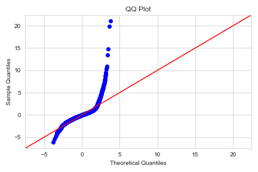

# Multiple Linear Regression: Predicting Housing Prices in King County, Washington for Haven-Kings Property Management


Haven-Kings Property Management aims to transform house pricing by utilizing predictive models based on property attributes. 

This research is an iterative method to developing a multiple linear regression model to predict house sale prices in King County, WA, using data from properties sold in 2014 and 2015. 

The first part of this project is spent cleaning the data, designing a few additional features, and then building models, modifying each model until a final model is built.

The following is a list of all models constructed, as well as a broad description of the differences between each model:

### 1. Model 1: Using All Features
Our first model yields an adjusted r-squared of.736, however the residuals were not normal, contradicting our assumption of normality.




### 2. Model 2: 2. Normalizing the dependent variable
Our r-squared was reduced to.723 after removing outliers and limiting the size of our dependent variable, but our residuals now much more closely resemble a normal distribution. 


## Repository Navigation (To be edited to fit names of our final files)

- **Code:** The 'code' directory contains Python scripts for data preprocessing, analysis, and modeling. 
- **Data:** The 'data' directory includes the datasets used in the project.
- **Images:** This directory contains images and visualizations used in the presentation. *****
- **Presentation:** The 'presentation' directory contains our detailed project presentation.
- **README:** You are here!

## The Process
### 1. Dataset

The dataset, sourced from the KC House Data, includes features such as:

- `id` - Unique ID for each home sold
- `date` - Date of the home sale
- `price` - Price of each home sold
- `bedrooms` - Number of bedrooms
- `bathrooms` - Number of bathrooms
- `sqft_living` - Square footage of the home
- ... and many more!

**Dependencies**

- Python 3.x
- ScikitLearn
- Pandas
- Numpy
- Matplotlib
- Seaborn

To install the necessary libraries, use the following:

```python
!pip install scikit-learn pandas numpy matplotlib seaborn
```

### 2. Data Processing
We cleaned and prepared the data, handling missing values, outliers, and data transformation where necessary. This step ensured the dataset's quality and consistency.

### 3. Exploratory Data Analysis (EDA)  
EDA involved analyzing the dataset's characteristics, visualizing trends, and identifying key factors influencing house prices.

### 4. Predictive Modeling (To be completed. Need to add a few visuals from analysis) *****
We employed multiple linear regression and machine learning techniques to build predictive models for:
- Optimizing house pricing
- Predicting renovation needs
- 
**Model Building**: Utilize ScikitLearn's Linear Regression to predict house prices. ****
**Model Evaluation**: Use metrics like R-squared, RMSE, etc. to evaluate the model's performance. *****

### 5. Conclusion

Multiple regression analysis was used to test if certain variables significantly predicted the 
sale price of homes in King County, Washington. The results of the regression indicated that 
14 predictors and 2 interaction terms explained 75.6% of the variance (R2= 0.756, F=2470, p< 0.01). All of the independent variables used in the model were significant predictors of sale price with p-values less than 0.05. For further analysis, other models can be used to improve accuracy of results, such as a Random Forest Regression model. Additionally, one could build a second regression model to predict prices of homes over 900k.


 ### 6. Presentation *****
Our findings and insights are summarized in a presentation that provides a comprehensive view of our data analysis and recommendations for Haven-Kings Property Management.

For a detailed overview of our project and its outcomes, please refer to our presentation:
[Real Estate Presentation](link_to_presentation)


## **Team Members**
 Juliet Iswana,  Oscar Mulei, Wayne Korir, Eva Kiio
1. **[Name 1]** - Responsible for data cleaning and preprocessing.
    - Email: name1@email.com
    - GitHub: [Profile Link](#)
2. **[Name 2]** - Led the data visualization and exploratory data analysis.
    - Email: name2@email.com
    - GitHub: [Profile Link](#)
3. **[Name 3]** - Handled feature engineering and model building.
    - Email: name3@email.com
    - GitHub: [Profile Link](#)
4. **[Name 4]** - Took charge of model evaluation and documentation.
    - Email: name4@email.com
    - GitHub: [Profile Link](#)

## **Contribution**
Feel free to explore the repository to access the code, data, and presentation related to our real estate data analysis and pricing optimization project. We encourage community contributions. If you find any bugs or areas of improvement, please create an issue or submit a pull request on our GitHub repository.
