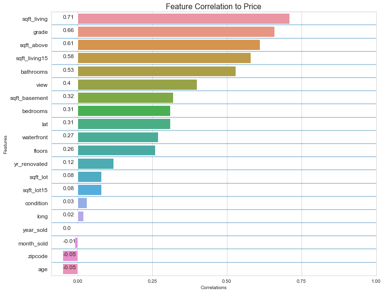
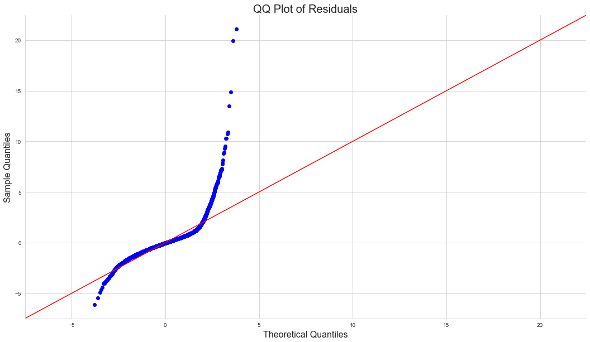
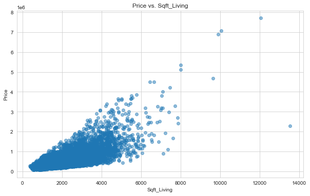
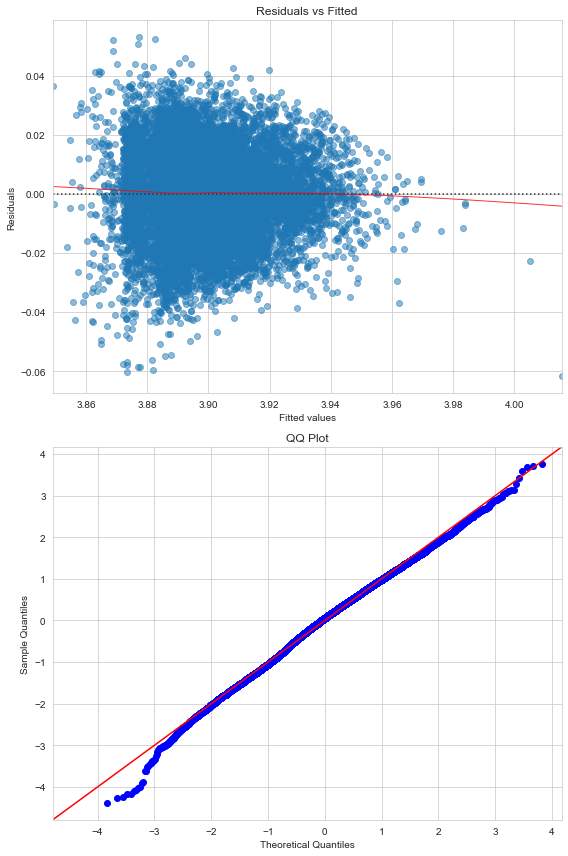
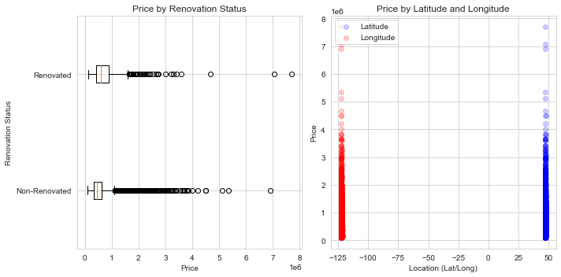

# Optimizing Real Estate Strategies in King County: A Data-Driven Approach for Haven-Kings Property Management

## Table of Contents
1. [Project Team](#project-team)
2. [Supervisor](#supervisor)
3. [Business Case](#business-case)
4. [Overview](#overview)
5. [Objective](#objective)
6. [Research Questions](#research-questions)
7. [Data Source](#data-source)
8. [Data Exploration](#data-exploration)
9. [Modeling](#modeling)
    - [House Pricing Models](#house-pricing-models)
    - [Dynamic Pricing Recommendations Models](#dynamic-pricing-recommendations-models)
10. [Conclusions](#conclusions)
11. [Recommendations and Action Points](#recommendations-and-action-points)
12. [Tech Stack](#tech-stack)
13. [How to Run This Project](#how-to-run-this-project)
14. [Acknowledgments](#acknowledgments)

## Project Team
- [Julliet Iswana](https://github.com/Iswana-O)
- [Wayne Kipngeno Korir](https://github.com/waynekipngeno)
- [Eva Kiio](https://github.com/evamwende)
- [Oscar Mulei](https://github.com/omulei)

## Supervisor
- [Asha Deen](https://moringaschool.com/courses/data-science-course-part-time/)

**Business Case:**
In the thriving real estate market of King County, the capacity to make strategic pricing decisions can either enhance profits or turn assets into liabilities. Haven-Kings Property Management, with its vast portfolio, stands at a pivotal juncture where conventional pricing methods no longer suffice. The digital age demands a shift from age-old practices like the Comparative Market Analysis (CMA) and the "1% Rule" to a more agile, data-driven approach. By leveraging advanced analytical methods, such as multiple regression analysis, property management firms can tap into precise pricing strategies, enhancing revenue streams and ensuring sustainable growth.

**Overview:**
This project aims to harness the power of data analytics to revolutionize Haven-Kings Property Management's pricing strategies in King County's competitive real estate landscape.

**Objective:**
Guided by data insights and multiple regression analysis, the team sets out to:
1. **Optimize House Pricing:** Craft a model that tailors pricing based on property features, regional nuances, and emerging market trends.

2. **Dynamic Pricing Recommendations:** Pivot rental prices in real-time, aligning with market fluctuations and property specifics.

**Research Questions:**
1. **House Pricing:** 
   - Dissect key determinants shaping house prices in King County.
   - Analyze the interplay between property attributes and their market value.
   - Appraise the precision of the regression model in predicting property prices.
     
2. **Dynamic Pricing Recommendations:**
   - Construct a robust framework for real-time pricing using multiple regression analysis.
   - Spotlight pivotal factors for adaptive rental rate revisions.
   - Assess the ramifications of dynamic pricing on revenue trajectories and market stature.

**Data Source:**
The foundation of this project rests on the [kc_house_data.csv](./data/kc_house_data.csv) dataset from King County House Sales.

## Data Exploration
The exploration starts with understanding the correlation between each predictor and price, followed by visualizing these correlations.

There are evident multicollinearity issues that need addressing. Notably:
- `sqft_above` and `sqft_living` are closely linked. `sqft_living` is preferred due to its encompassing nature.
- `sqft_lot` is chosen over `sqft_lot15` due to its direct relation to the house.

## Modeling

To address the research questions, multiple regression models are employed, each focusing on relevant independent variables (features) to predict the dependent variable (target). The primary dependent variable for these models is `price`.

### House Pricing Models
#### Model 1: House Price Determinants
- **Objective**: ...
- **Methodology**: ...
- **Results**: ...

#### Model 2: Impact of Living Space on House Price
[Details here]

#### Model 3: Property Attributes and Their Influence on Market Value

### Dynamic Pricing Recommendations Models
#### Model 4: Dynamic Pricing Recommendations
[Details here]

## Conclusions:
1. **Data-Driven Decision Making:** Given the depth and breadth of data available from King County House Sales, data-driven decision-making is not only feasible but also crucial for optimizing real estate strategies.
2. **Significance of Property Attributes:** Preliminary exploration emphasizes the significance of attributes like number of bedrooms, living area size, and location on house prices.
3. **Data Quality:** Data preprocessing steps highlighted the importance of maintaining data quality, especially in key features like 'waterfront', 'view', and 'yr_renovated'.
4. **Potential for Predictive Modeling:** The nature of the dataset, with its rich features, indicates strong potential for building predictive models for house pricing.

## Recommendations-and-Action-Points

1. **Deep Dive into EDA:** Further exploration and visualization are needed to understand the relationships between different features and house prices. This would provide more nuanced insights into how different attributes interplay to determine property prices.
2. **Focus on Location Analysis:** Given the dataset's geographical details (latitude and longitude), a deeper geographical analysis can provide insights into location-based pricing strategies.
3. **Predictive Modeling:** Regression analysis, as mentioned in the business case, should be the starting point. However, exploring other machine learning models can provide more accurate pricing predictions.
4. **Addressing Data Gaps:** Ensure routine checks for missing or inconsistent data, especially for significant features.

#### Action Points:
1. **Enhanced Data Collection:** Continuously update and expand the dataset. Include more recent sales data and potentially other external factors (e.g., economic indicators, neighborhood developments).
2. **Modeling and Validation:** Begin with regression models for price prediction, and as more data becomes available, explore complex algorithms. Regularly validate and refine these models using new data.
3. **Development of Dynamic Pricing Tools:** Build tools that leverage the predictive models. These tools should offer real-time pricing recommendations to the sales and management teams.
4. **Feedback Mechanism:** Implement a mechanism where the ground-level sales team can provide feedback on pricing recommendations. This would allow for iterative refinement of the models and strategies.
5. **Training & Workshops:** Organize regular training sessions for the sales and management teams. Ensure they understand and trust the data-driven recommendations.

By adopting these conclusions, recommendations, and action points, Haven-Kings Property Management can achieve a competitive edge in the King County real estate market, leading to increased profitability and growth.

## Tech Stack
- Python
- Jupyter Notebook
- Pandas, Numpy
- Scikit-learn
- Matplotlib, Seaborn

